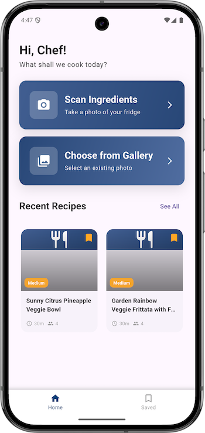
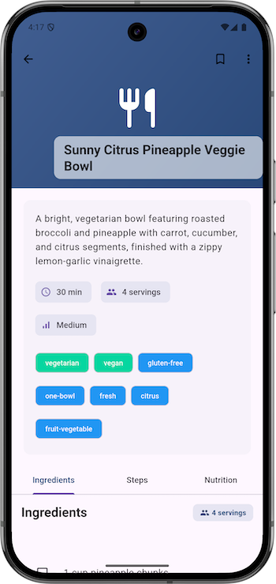
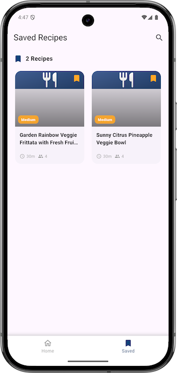
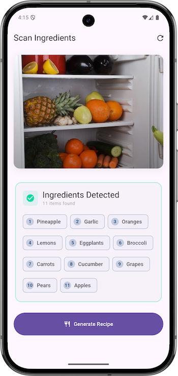

# AI Meal Planner

A Flutter mobile application that uses AI to generate recipes from scanned ingredients. 
This application integrates both OpenAI and Gemini models for robust ingredient detection and recipe generation.

## Screenshots

   
  

## Features

*   **AI Ingredient Detection**: Snap a photo or choose from the gallery to automatically detect ingredients using advanced vision models.
*   **Smart Recipe Generation**:
    *   Generates comprehensive recipes based on available ingredients.
    *   **Customizable Options**:
        *   Adjust servings (1-12 people)
        *   Dietary restrictions (Vegetarian, Vegan, Gluten-Free, Keto, etc.)
        *   Cuisine preferences (Italian, Mexican, Asian, etc.)
        *   Complexity levels (Simple, Medium, Complex)
        *   Additional notes for specific requests
    *   **Real-time Streaming**: Watch the recipe being created in real-time.
*   **Recipe Management**:
    *   Save your favorite recipes.
    *   View detailed instructions, ingredients, and nutritional information.
    *   Organized tabbed interface for easy reading.

## Tech Stack

*   **Framework**: Flutter (v3.10+)
*   **State Management**: Riverpod
*   **Navigation**: GoRouter
*   **Networking**: Dio
*   **Local Database**: Drift (SQLite)
*   **AI/ML Integration**:
    *   **OpenAI API**: Used for vision recognition and recipe text generation.
*   **UI/UX**:
    *   Material Design 3
    *   Flutter Animate for smooth interactions
    *   Shimmer for loading states
    *   Google Fonts

## Getting Started

1.  **Clone the repository**
    ```bash
    git clone https://github.com/niyiment/meal_planner.git
    ```

2.  **Install dependencies**
    ```bash
    flutter pub get
    ```

3.  **Configure Environment Variables**
    *   Create a `.env` file in the root directory.
    *   Add your API keys:
        ```
        OPENAI_API_KEY=your_openai_api_key
        ```

4.  **Run the app**
    ```bash
    flutter run
    ```

## Project Structure

```
lib/
├── core/            # Core functionality (Network, Database, Utils, Service)
│   ├── network/     # Dio setup and interceptors
│   ├── service/     # AI Service implementations (OpenAI, Gemini)
│   └── ...
├── features/        # Feature-based architecture
│   ├── home/        # Home screen and navigation
│   ├── scan/        # Camera, AI processing logic, and Recipe Options
│   └── recipe/      # Recipe details, list, and database interactions
└── main.dart        # Entry point
```

## Contributing

Contributions are welcome! Please feel free to submit a Pull Request.
